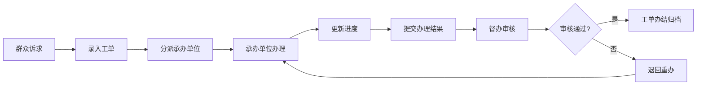

## 1. 产品概述

12345热线工单办理系统是一个简化版的政务服务工单管理平台，用于接收群众诉求、分派承办单位、跟踪办理进度、督办超期工单。系统面向两类用户：承办单位人员负责处理具体工单，督办人员负责监督办理质量和时效。

- **核心目标**：实现工单全流程数字化管理，提高办理效率，保障群众诉求及时响应
- **目标用户**：12345热线承办单位人员、督办工作人员
- **产品价值**：规范工单办理流程，实时监控办理状态，降低超期率，提升群众满意度

## 2. 核心功能

### 2.1 用户角色

| 角色 | 登录方式 | 核心权限 |
|------|----------|----------|
| 承办单位人员 | 账号登录 | 查看本单位工单、更新处理进度、填写办理结果、上传附件 |
| 督办人员 | 账号登录 | 查看全部工单、超期风险监控、退回重办、催办记录、数据统计 |

### 2.2 功能模块

1. **工单列表页**：工单总览、多条件筛选、状态标签、快速操作
2. **工单详情页**：工单信息展示、办理时间线、进度更新、结果提交
3. **新建工单页**：诉求登记表单、分类选择、区域选择、承办单位分派
4. **督办中心页**：超期预警、退回重办、催办记录、风险统计

### 2.3 页面详情

| 页面名称 | 模块名称 | 功能描述 |
|----------|----------|----------|
| 工单列表页 | 筛选区 | 按状态、区域、承办单位、期限、诉求类型多维度筛选 |
| 工单列表页 | 工单列表 | 工单卡片列表，展示核心信息和状态标签 |
| 工单列表页 | 统计概览 | 待办、办理中、已办结、超期工单数量统计 |
| 工单详情页 | 基本信息 | 诉求分类、所属区域、诉求内容、交办时间、办理期限、承办单位 |
| 工单详情页 | 办理时间线 | 办理进度历史记录，按时间倒序展示 |
| 工单详情页 | 进度更新 | 承办单位更新处理进度、填写办理结果、上传附件 |
| 工单详情页 | 督办操作 | 督办人员可退回重办、发起催办 |
| 新建工单页 | 表单填写 | 诉求分类、所属区域、诉求内容、承办单位、办理期限 |
| 新建工单页 | 提交分派 | 提交工单并自动分派到承办单位 |
| 督办中心页 | 超期预警 | 展示即将到期和已超期工单，高亮风险等级 |
| 督办中心页 | 催办记录 | 查看所有催办历史记录 |
| 督办中心页 | 退回重办 | 对不合格工单退回重办并填写原因 |

## 3. 核心流程

### 3.1 工单办理主流程

群众通过12345热线提交诉求 → 坐席人员录入系统生成工单 → 分派给对应承办单位 → 承办单位接收并开始办理 → 定期更新处理进度 → 办结后提交办理结果 → 督办人员审核 → 工单归档

### 3.2 督办流程

督办人员查看工单列表 → 识别超期/即将超期工单 → 发起催办 → 记录催办信息 → 跟踪办理进度 → 审核办理结果 → 归档或退回

## 4. 用户界面设计

### 4.1 设计风格

- **主色调**：政务蓝（#1E40AF），体现专业、可信的政务形象
- **辅助色**：橙色（#EA580C）用于超期预警，绿色（#059669）用于已办结，黄色（#CA8A04）用于办理中
- **按钮风格**：圆角矩形按钮，hover时有轻微阴影和背景加深效果
- **字体**：思源黑体 / Noto Sans SC，清晰易读
- **布局风格**：顶部导航栏 + 左侧侧边栏 + 右侧内容区的经典后台管理布局
- **卡片设计**：白色卡片，浅灰色边框，悬停时轻微上浮效果

### 4.2 页面设计概述

| 页面名称 | 模块名称 | UI元素 |
|----------|----------|--------|
| 工单列表页 | 顶部统计卡片 | 四个彩色统计卡片，分别展示待办、办理中、已办结、超期数量 |
| 工单列表页 | 筛选栏 | 下拉选择器组合，包含状态、区域、承办单位、期限、诉求类型 |
| 工单列表页 | 工单表格 | 数据表格，每行一条工单，带状态标签和操作按钮 |
| 工单详情页 | 信息概览 | 左右两栏布局，左侧基本信息，右侧状态和时间信息 |
| 工单详情页 | 时间线 | 垂直时间线，展示办理全过程记录 |
| 工单详情页 | 操作区 | 底部操作按钮组，根据角色显示不同操作 |
| 新建工单页 | 表单 | 分组表单，分类选择用下拉框，内容用多行文本框 |
| 督办中心页 | 风险看板 | 三色风险等级卡片（高/中/低），超期工单列表 |

### 4.3 响应式设计

- **桌面优先**：以1440px宽度为基准设计
- **平板适配**：1024px时侧边栏可收起，表格横向滚动
- **移动适配**：768px以下改为上下布局，卡片堆叠展示

### 4.4 动效与交互

- 页面加载时统计数字递增动画
- 状态标签颜色渐变过渡
- 表格行hover背景色变化
- 模态框淡入淡出效果
- 时间线节点脉冲动画（最新状态）
