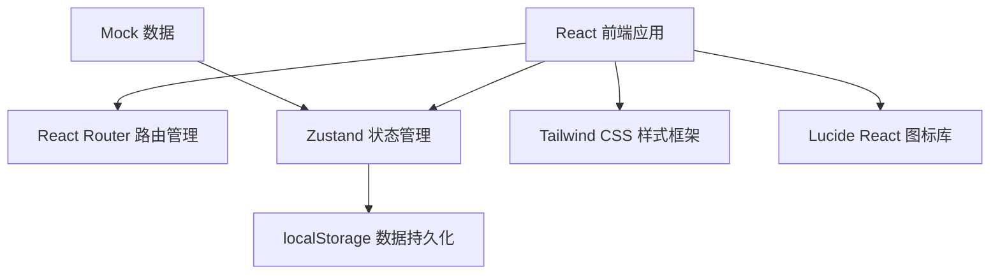
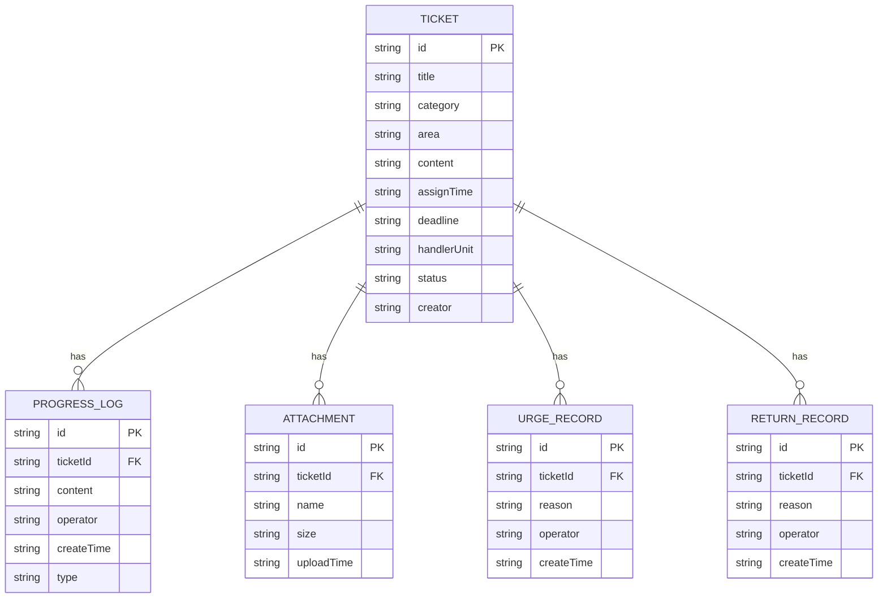

## 1. 架构设计

本项目为纯前端工单管理系统，使用Mock数据模拟后端，状态通过Zustand管理，数据持久化到localStorage。



## 2. 技术说明

- **前端框架**：React@18 + TypeScript
- **构建工具**：Vite@5
- **样式方案**：Tailwind CSS@3
- **状态管理**：Zustand
- **路由管理**：React Router DOM@6
- **图标库**：Lucide React
- **数据持久化**：localStorage（模拟后端存储）
- **初始化方式**：vite-init 脚手架

## 3. 路由定义

| 路由 | 页面名称 | 说明 |
|------|----------|------|
| / | 工单列表页 | 系统首页，展示工单列表和筛选功能 |
| /tickets/:id | 工单详情页 | 展示工单详细信息、办理时间线和操作按钮 |
| /tickets/new | 新建工单页 | 表单页面，用于录入新的诉求工单 |
| /supervision | 督办中心页 | 超期预警、催办记录、退回重办管理 |

## 4. 数据模型

### 4.1 实体关系图



### 4.2 工单状态枚举

| 状态值 | 显示名称 | 说明 |
|--------|----------|------|
| pending | 待办理 | 工单已分派，承办单位尚未开始处理 |
| processing | 办理中 | 承办单位正在处理中 |
| completed | 已办结 | 承办单位已提交办理结果 |
| overdue | 已超期 | 超过办理期限仍未办结 |
| returned | 已退回 | 督办审核不通过，退回重办 |

### 4.3 诉求分类枚举

| 分类 | 说明 |
|------|------|
| 城市管理 | 市容环境、市政设施等 |
| 交通运输 | 公交、地铁、道路等 |
| 住房建设 | 房产、物业、建设等 |
| 劳动社保 | 就业、社保、工资等 |
| 教育文化 | 学校、文化、体育等 |
| 医疗卫生 | 医院、医保、疾控等 |
| 环境保护 | 污染、噪音、绿化等 |
| 市场监管 | 消费、价格、质量等 |

### 4.4 区域枚举

| 区域 |
|------|
| 东城区 |
| 西城区 |
| 朝阳区 |
| 海淀区 |
| 丰台区 |
| 石景山区 |
| 通州区 |
| 昌平区 |

### 4.5 承办单位枚举

| 单位 |
|------|
| 城市管理委员会 |
| 交通委员会 |
| 住房和城乡建设委员会 |
| 人力资源和社会保障局 |
| 教育委员会 |
| 卫生健康委员会 |
| 生态环境局 |
| 市场监督管理局 |

## 5. 项目结构

```
src/
├── components/          # 公共组件
│   ├── Layout/         # 布局组件
│   ├── TicketCard/     # 工单卡片
│   ├── TicketTable/    # 工单表格
│   ├── FilterBar/      # 筛选栏
│   ├── StatusBadge/    # 状态标签
│   ├── Timeline/       # 时间线
│   └── Modal/          # 模态框
├── pages/              # 页面组件
│   ├── TicketList/     # 工单列表页
│   ├── TicketDetail/   # 工单详情页
│   ├── NewTicket/      # 新建工单页
│   └── Supervision/    # 督办中心页
├── store/              # Zustand状态管理
│   └── useTicketStore.ts
├── types/              # TypeScript类型定义
│   └── index.ts
├── utils/              # 工具函数
│   ├── date.ts
│   └── mock.ts
├── data/               # Mock数据
│   └── mockData.ts
├── App.tsx
├── main.tsx
└── index.css
```

## 6. 核心功能实现说明

### 6.1 工单筛选

通过多维度组合筛选：状态、区域、承办单位、期限（剩余天数）、诉求类型。筛选条件通过URL参数同步，支持刷新保留。

### 6.2 超期风险计算

- **高风险**：已超期或剩余期限 < 1天
- **中风险**：剩余期限 1-3 天
- **低风险**：剩余期限 > 3 天

### 6.3 办理时间线

按时间倒序展示工单全生命周期记录：工单创建、进度更新、催办、退回、办结等。

### 6.4 状态流转

待办 → 办理中 → 已办结 → （审核）→ 归档
                              ↓
                           退回重办 → 办理中
